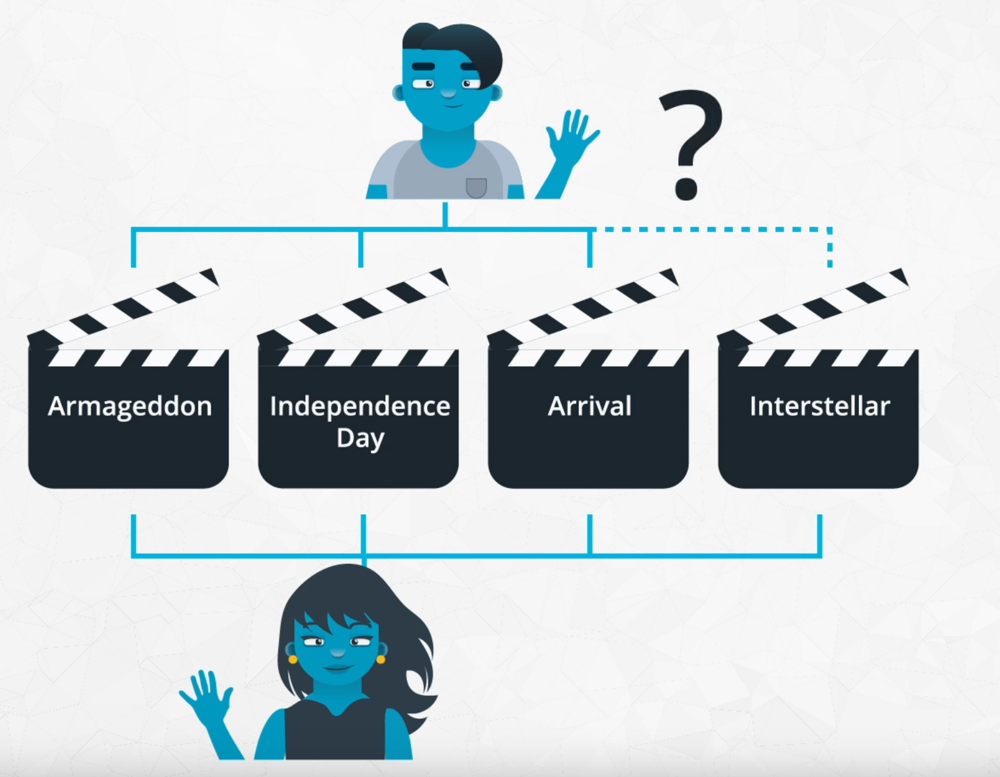

# Recommendation System
 Type of Recommendation Systems
 
 In this Repository, I will be working with the MovieTweetings data to apply each of the three methods of recommendations:
 ***
    1. Knowledge Based Recommendations 
    2. Collaborative Filtering Based Recommendations 
    3. Content Based Recommendations 
***

## 1. MovieTweetings data

If you would like additional information about the MovieTweetings data, you can find more information at the links provided here:

* [Getting to Know The Data](https://github.com/A2Amir/Recommendation-Systems/blob/main/1.Introduction%20to%20the%20Recommendation%20Data.ipynb)

* [The MovieTweetings white paper. ](http://crowdrec2013.noahlab.com.hk/papers/crowdrec2013_Dooms.pdf)
* [A Github account set up for MovieTweetings ](http://crowdrec2013.noahlab.com.hk/papers/crowdrec2013_Dooms.pdf)
* [A slide deck by Simon Doom about MovieTweetings. ](https://www.slideshare.net/simondooms/movie-tweetings-a-movie-rating-dataset-collected-from-twitter)

## 1. Knowledge Based Recommendations

Knowledge based recommendations frequently are implemented using filters, and are extremely common amongst luxury based goods. Filters that you might see when purchasing items like cars or homes are examples of knowledge based recommendations. In knowledge based recommendations, users provide information about the types of recommendations they would like back.

 Take a look at the filters available on Zillow in the image below. This is an example of building in a knowledge based recommendation, as users can add their own preferences to the items that are provided.

Often a rank based algorithm is provided along with knowledge based recommendations to bring the most popular items in particular categories to the user's attention. In the linke below, you will get some practice implementing this type of recommendation for the MovieTweetings dataset.

* [Knowledge Based_Recommendations](https://github.com/A2Amir/Recommendation-Systems/blob/main/2.%20%20Knowledge%20Based_Recommendations.ipynb)

## 2.Collaborative filtering

Collaborative filtering is a method of making recommendations based only on the interactions between users and items.  We don't need any information about items and users (information like user like or dislike item, … will be needed)

for example We know that Rima and Amir both have similar tastes in books. If we recommend a book Rima has read to Amir, this is an example of a...collaborative filtering(see below).

There are two main ways to implement collaborative filtering:

  1. Model Based Collaborative Filtering which uses machine learning techniques to make recommendation
  2. Neighborhood Based Collaborative Filtering which is used to identify items or users that are "neighbors" with one another.
    
There are a number of ways we might go about finding an individual's closest neighbors - the metrics we will take a closer look at include:

    1. Pearson's correlation coefficient 
    2. Spearman's correlation coefficient 
    3. Kendall's Tau 
    4. Euclidean Distance 
    5. Manhattan Distance 

In the linke below, you will work through a few examples to get more familiar with how each of these metrics is computed, and why you might use one over another.

* [Measuring Similarity ](https://github.com/A2Amir/Recommendation-Systems/blob/main/3.%20Measuring%20Similarity%20.ipynb)

To create **Neighborhood Based Collaborative Filtering** recommendations, we need to use the ratings from our neighbors to influence the ratings we provide to other users. There are a few ways to do this, but a simple method would be to:

    1. Remove movies our user has already seen. 
    2. Find ratings of the neighbors that are high. 
    3. Recommend movies to each user where both 1 and 2 above hold. 

In the notebook below, it is implemented the three-step process above to make recommendations for every user in the dataset.

* [Collaborative Filtering](https://github.com/A2Amir/Recommendation-Systems/blob/main/4.%20Collaborative%20Filtering%20.ipynb)

Other methods for making recommendations using collaborative filtering are based on weighting of the neighbors' ratings based on the 'closeness' of the neighbors. You can use each of the following two papers to learn more about this technique:

* [omino Data Lab Paper](https://blog.dominodatalab.com/recommender-systems-collaborative-filtering/)
* [Semantic Scholar Paper On Weighted Ratings](https://pdfs.semanticscholar.org/3e9e/bcd9503ef7375c7bb334511804d1e45127e9.pdf)

## 2.Content Based Recommendations

In [the previous notebook](https://github.com/A2Amir/Recommendation-Systems/blob/main/4.%20Collaborative%20Filtering%20.ipynb)
, I implemented collaborative filtering to make recommendations based on finding similar users. However, there were a number of users who did not receive recommendations when using this technique. For this reason, we might use **the Content Based Recommendationsn technique** to find items to recommend to users. 
In this recommendation technique, we use information that is known about the user or item to make recommendations. This method of making recommendations is particularly useful when we **do not have a lot of user-item connections available in our dataset**. 

It might be the case that content based and collaborative filtering based techniques come up with similar recommendations, but the methods by which data scientists approach these recommendations are very different. In collaborative filtering, you are using the connections of users and items (as you did before). In content based techniques, you are using information about the users and items, but not connections (hence the usefulness when you do not have a lot of internal data already available to use). By checking the link below you can take a look at how I implemented this method with the MovieTweetings data.

* [Content Based Recommendations](https://github.com/A2Amir/Recommendation-Systems/blob/main/5.%20Content%20Based%20Recommendations.ipynb)

